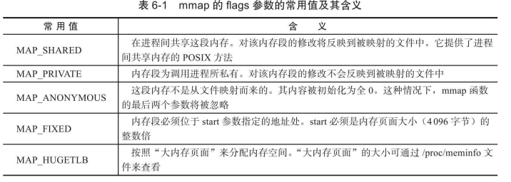
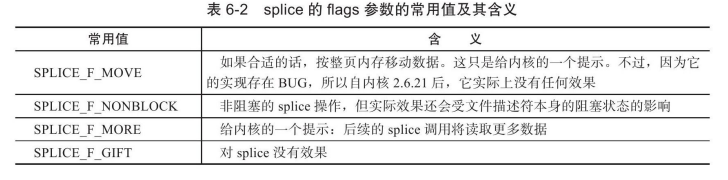
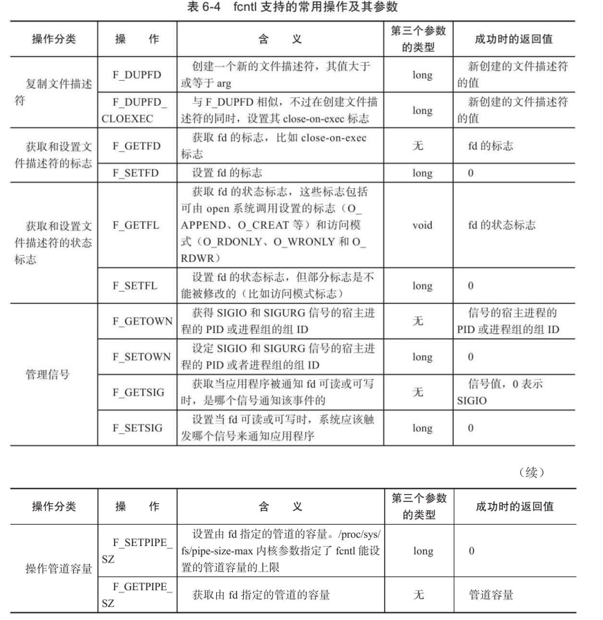
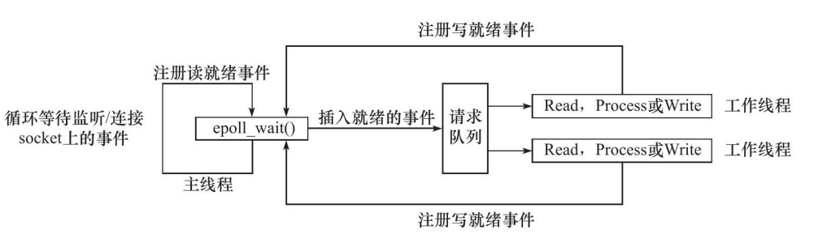
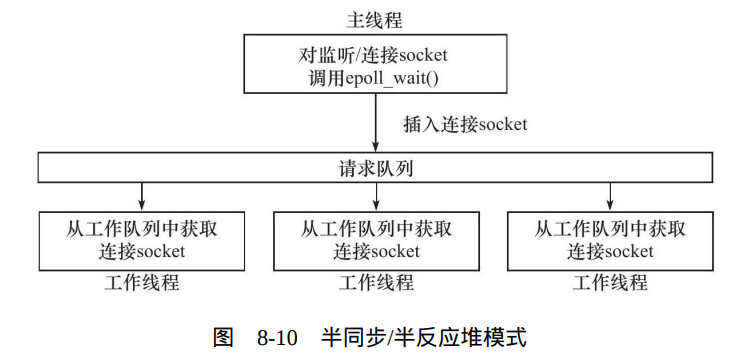
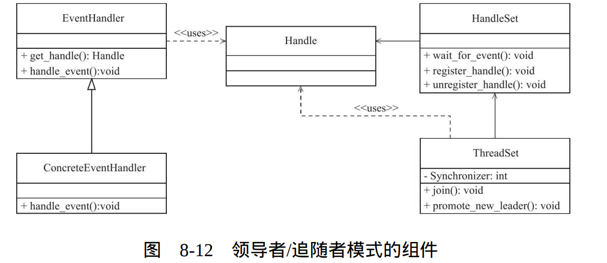
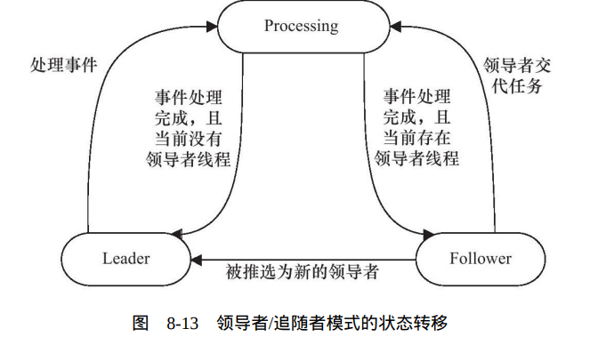
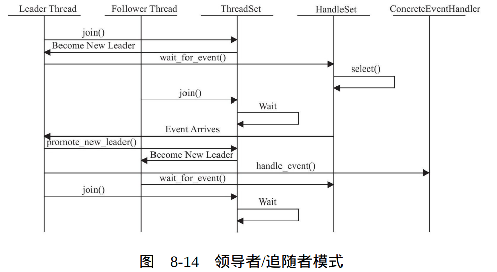

# Linux-server-coding

 

## linux网络编程基础API

### 字节序

发送端总是把要发送的数据转化成大端字节序数据后再发送，而接收端知道对方传送过来的数据总是采用大端字节序，所 以接收端可以根据自身采用的字节序决定是否对接收到的数据进行转换（小端机转换，大端机不转换）。因此大端字节序也称为网络字节序，它给所有接收数据的主机提供了一个正确解释收到的格式化数据的保证。即使是同一台机器上的两个进程（比如一个由C语言编写，另一个由JAVA编写）通信，也要考虑字节序的问题（JAVA虚拟机采用大端字节序）。

linux体统了4个函数用于完成主机字节序和网络字节序之间的转换

```c
#include <netinet/in.h>
unsigned long int htonl(unsigned long int hostlong);
unsigned short int htons(unsigned short int hostshort);
unsigned long int ntohl(unsigned long int netlong);
unsigned short int ntohs(unsigned short int netshort);
```

### 通用socket地址

socket网络编程中表示socket地址的是结构体```sockaddr``，定义：

```c
#include <bits/socket.h>
struct sockaddr{
	sa_family_t sa_family;   //存放地址族
	char sa_data[14];        //存放socket地址值，不同协议族的地址值具有不同的涵义和长度
}
```

| 协议族   | 地址值含义和长度                                             |
| -------- | ------------------------------------------------------------ |
| PF_UNIX  | 文件路径名，长度可达到108字节                                |
| PF_INET  | 16 bit 端口号 32 bit IPV4地址，共6字节                       |
| PF_INET6 | 16 bit 端口号 32 bit 流标志，128 bit IPV6地址，32bit范围ID，共26字节 |

14字节的sa_data根本无法完全容纳多数协议族的地 址值。因此，Linux定义了下面这个新的通用socket地址结构体：

```c
#include <bits/socket.h>
struct sockaddr_storage
{
	sa_family_t sa_family;
	unsigned long int __ss_align;
	char __ss_padding[128 - sizeof(__ss_align)];
}
```

### 专用socket地址

上述地址结构若要获取 IP 和 端口，需要进行繁琐的按位操作，Linux为各个协议族提供了专门的socket地址结构

```c
#include <sys/un.h>
struct sockaddr_un
{
	sa_family_t sin_family;    //地址族:AF_UNIX
	char sun_path[108];        //文件路径名
}
struct sockaddr_in
{
	sa_family_t sin_family;        //地址族:AF_INET
	u_int16_t sin_port;			  //端口号
	struct in_addr sin_addr;       //IPV4地址结构体
}
struct in_addr
{
	u_int32_t s_addr;				/*IPv4地址，要用网络字节序表示*/
};
struct sockaddr_in6
{
	sa_family_t sin6_family;	/*地址族：AF_INET6*/
	u_int16_t sin6_port;		/*端口号，要用网络字节序表示*/
	u_int32_t sin6_flowinfo;	/*流信息，应设置为0*/
	struct in6_addr sin6_addr;	/*IPv6地址结构体，见下面*/
	u_int32_t sin6_scope_id;	/*scope ID，尚处于实验阶段*/
};
struct in6_addr
{
	unsigned char sa_addr[16];	/*IPv6地址，要用网络字节序表示*/
}；
```

所有专用socket地址（以及sockaddr_storage）类型的变量在实际使 用时都需要转化为通用socket地址类型sockaddr（强制转换即可），因为所有socket编程接口使用的地址参数的类型都是sockaddr。

### IP地址转换函数

点分十进制字符串和网络字节序证书表示IPV4地址之间的转换函数

```c
#include <arpa/inet.h>
in_addr_t inet_addr(const char * strptr);
/*将用点分十进制字符串表示的IPv4地址转化为用网络
字节序整数表示的IPv4地址。它失败时返回INADDR_NONE。*/

int inet_aton(const char * cp , struct in_addr * inp);
/*将点分十进制转化为网络字节序，并将结果储存在inp所指位置，成功返回 1 ， 失败返回 0*/

char * inet_ntoa(struct in_addr in);
/*将用网络字节序整数表示的IPv4地址转化为用点分十进制字符串表示的IPv4地址。
但需要注意的是，该函数内部用一个静态变量存储转化结果，
函数的返回值指向该静态内存，因此inet_ntoa是不可重入的。*/
```

新更新的函数，并且还能同时适用于 IPV4 和 IPV6

```c
#include <arpa/inet.h>
int inet_pton(int ad , const char * src , void * dest);
/*
用于将点分十进制/16进制 ip 转化为网络字节序，并把转换结果存储于dst指向的内存中。
af用于指定地址族，成功时返回1，失败则返回0并设置errno
*/
const char * intet_ntop(int af , const void * src , char * dst , socklen_t cnt);
/*
用于将网络字节序转化为对应的 ip 地址，最后一个参数cnt指定目标存储单元的大小
可以使用下面两个宏定义：
#include <netinet/in.h>
#define INET_ADDRSTRLEN 16
#define INET6_ADDRSTRLEN 46

inet_ntop成功时返回目标存储单元的地址，失败则返回NULL并设置errno。
*/
```

### 创建socket

```c
#include <sys/types.h>
#include＜sys/socket.h＞
int socket(int domain,int type,int protocol);
/*
domain:系统使用那个底层协议族，TCP/IP - PF_INET		UNIX本地 - PF_UNIX
type:指定服务类型， 流服务 - SOCK_STREAM		数据报 - SOCK_UGRAM
自Linux内核版本2.6.17起，type参数可以接受上
述服务类型与下面两个重要的标志相与的值：SOCK_NONBLOCK和
SOCK_CLOEXEC。它们分别表示将新创建的socket设为非阻塞的，以
及用fork调用创建子进程时在子进程中关闭该socket。
protocol: 前两个参数已经完全决定了它的值）。几乎在所有情况下，我们都应该把它设置为0

socket系统调用成功时返回一个socket文件描述符，失败则返回-1并设置errno
*/
```

### 命名socket

将一个socket与socket地址绑定称为给 socket命名。

```c
#include <sys/types.h>
#include <sys/socket.h>
int bind(int sockfd , const struct sockaddr * my_addr , socklen_t addrlen_);
/*
将myaddr所指的socket地址分配给未命名的sockfd，addr是socket地址的长度
bind成功时返回0，失败则返回-1并设置errno。
常见errno有两个值：EACCES EADDRINUSE
EACCES:绑定地址是受保护的，仅root用户可以访问，如:普通用户将socket绑定到知名端口时会返回EACCES错误
EADDRINUSE:被绑定的地址正在使用，如:嫁给你socket绑定到一个处于TIME_WAIT状态的socket地址
*/
```

### 监听socket

socket被命名后还不能马上接受客户连接，还需要使用listen系统调用创建监听队列存放待处理的客户连接

```c
#include <sys/socket.h>
int listen(int sockfd , int backlog);
/*
sockfd:被监听的socket，backlog参数提示内核监听队列的最大长度
监听队列的长度如果超过backlog，服务器将不受理新的客户连接，客户端也将收到ECONNREFUSED错误信息。
成功时返回0，失败则返回-1并设置errno。
*/
```

### 接受连接

该系统调用从listen监听队列中接受一个连接

```c
#include <sys/types.h>
#include <sys/socket.h>
int accept(int sockfd , struct sockaddr * addr , socklen_t * addrlen);
/*
sockfd是执行过listen被监听的socket，addr参数用户获取连接远端的socket地址结构，
该socket地址的长度有参数addrlen参数指出。accept成功时返回一个新的连接socket,用于标识该连接
失败返回 - 并设置errno
*/
```

```accept```只是从监听队列中取出连接，不关心连接处于何种状态，更不关心网络状态的变化

### 发起连接

客户端通过connect函数主动连接服务器

```c
#include <sys/types.h>
#include <sys/socket.h>
int connect(int sockfd , const struct sockaddr * serv_addr , socklen_t addrlen);
/*
connect成功返回 0 一旦成功sockfd就唯一的标识了这个连接，失败返回 -1并设置errno
常见的errno有 ECONNREFUSED:目标端口不存在	ETIMEDOUT:连接超时
*/
```

### 关闭连接

关闭连接就是关闭对应的socket

```c
#include <unistd.h>
int close(int fd);
/*fd参数是待关闭的socket。不过，close系统调用并非总是立即关闭
一个连接，而是将fd的引用计数减1。只有当fd的引用计数为0时，才真
正关闭连接。多进程程序中，一次fork系统调用默认将使父进程中打开
的socket的引用计数加1，因此我们必须在父进程和子进程中都对该
socket执行close调用才能将连接关闭。*/
```

无论如何都要立即终止连接而不是将引用计数减一，shutdown函数

```c
#include <sys/socket.h>
int shutdown(int sockfd , int howto);
/*sockfd是待关闭的socket，howto决定了shutdown的行为：
SHUT_RD:关闭sockfd读端，应用程序不能再针对socket文件描述符执行读操作，并且socket接收缓冲区中的数据都被丢掉
SHUT_WR:关闭sockfd写这一半，sockfd的发送缓冲区中的数据会在真正关闭连接之前全部发送出去，应用程序不可再对该socket文件描述符执行写操作。连接属于半关闭状态
SHUT_RDWR:同时关闭sockfd上的读和写
shutdown成功返回 0 失败返回 -1 并设置errno */
```

### 数据读写

文件读写 read write 同样适用于socket，但socket提供了专门函数用于数据读写，其中适用于TCP流数据的系统调用：

```c
#include <sys/types.h>
#include <sys/socket.h>
ssize_t recv(int sockfd , void * buf , size_t len , int flags);
ssize_t send(int sockfd , const void * buf , size_t len , int flags);

/*
recv读取sockfd上的数据，buf和len分别指定了缓冲区的位置和大小，成功返回实际读取到的数据长度，当返回0时意味着通信对方关闭了连接，失败返回 -1 并设置errno

send往sockfd中填写数据，buf和len分别指定了缓冲区的位置和大小，成功返回实际写入数据的大小，失败返回 -1 并设置errno

flag为数据收发提供额外的控制
*/
```

UDP数据读写

```c
#include <sys/types.h>
#include <sys/socket.h>
ssize_t recvform(int sockfd , void *buf , size_t len , int flags , struct sockaddr * src_addr , socklen_t * addrlen);
ssize_t sendto(int sockfd , const void * buf , size_t len , int flags , const struct sockaddr * dest_addr , socklen_t addrlen);

/*
recform 读取sockfd上的数据，buf和len分别指定缓冲器的位置和大小。UDP是无连接的故需要指定发送端的地址结构，addrlen指向地址结构的长度
sendto向sockfd写数据dest_addr参数指定接收端的socket地址，addrlen参数则指定该地址的长度。
flag参数的取值与recv send相同
recvform 和 sendto 系统调用也可以用于面向连接的socket数据读写，只需将最后两参数设为NULL(因为我们已经和对方立了连接，所以已经知道其socket地址了)
*/
```

### 带外标记

在实际应用中，我们无法预测带外数据何时到来，好在Linux内核检测到TCP URG标志时将通知应用程序接收，如 IO复用产生异常和SIGURG信号，即使得到了通知还需要明确带外数据的具体位置才能准确接收带外数据

```c
#include <sys/socket.h>
int sockatmark(int sockfd);
/*此系统调用用于判断sockfd是否处于带外标记，即下一个被读取到的数
据是否是带外数据。如果是，sockatmark返回1，此时我们就可以利用
带MSG_OOB标志的recv调用来接收带外数据。如果不是，则sockatmark返回*/
```

### 地址信息函数

```c
#incldue <sys/socket.h>
int getsockname(int sockfd , struct sockaddr * address , socklen_t * address_len);
int getperrname(int sockfd , struct sockaddr * address , socklen_t * address_len);
/*
获取本端和对端的地址结构以及长度，保存在address所指的地址结构中和 address_len 所指的长度中
如果实际socket地址的长度大于address所指内存区的大小，那么该socket地址将被截断。
getsockname成功时返回0，失败返回-1并设置errno。
*/
```

### socket选项

fcntl时控制文件描述符的通用POSIX方法，如下两个系统调用用则是专门用来读取和设置socket文件描述符属性的方法：

```c
#include <sys/socket.h>
int getsockopt(int sockfd , int level , int option_name , void * option_value , socklen_t * restrict option_len);
int setsockopt(int sockfd , int level , int option_name , const void * option_value , socklen_t option_len);
/*sockfd参数指定被操作的目标socket。
level参数指定要操作哪个协议的选项（即属性）
option_name参数则指定选项的名字
option_value和option_len参数分别是被操作选项的值和长度。不同的选项具有不同类型的值*/
```


值得注意的是，对服务器而言，有部分socket选项只能在调用listen之前针对监听socket设置才是有效的。连接socket只能由accept返回，在此前l加入listen队列连接就已经进入了```SYN_REVCD```状态，意味着同步报文已经发送结束了，但有些socket选项却应该在同步报文中设置。对这种情况，Linux给开发人员提供的解决方案是：对监听socket设置这些socket选项，那么accept返回的连接socket将自动继承这些选项。这些socket选项包括 ：```SO_DEBUG、 SO_DONTROUTE、SO_KEEPALIVE、SO_LINGER、 SO_OOBINLINE、SO_RCVBUF、SO_RCVLOWAT、SO_SNDBUF、 SO_SNDLOWAT、TCP_MAXSEG和TCP_NODELAY```。而对客户端而言，这些socket选项则应该在调用connect函数之前设置，因为connect调 用成功返回之后，TCP三次握手已完成。

**SO_REUSEADDR选项：**

服务器程序可以通过设置socket选项SO_REUSEADDR来强制使用被处于 TIME_WAIT状态的连接占用的socket地址。

```c
int sock = socket(AF_INET,SOCK_STREAM,0);	int reuse = 1;
setsockopt(sock,SOL_SOCKET,CO_REUSEADDR,&reuse,sizeof(reuse));
```

经过setsockopt的设置之后，即使sock处于TIME_WAIT状态，与之绑定的socket地址也可以立即被重用。

### 网络信息API

gethostbyname 根据主机名获取主句完整信息，gethostbyaddr 根据IP地址获取主机完整信息。通常先在本地的/etc/hosts配置文件中查找主机，如果没有找到，再去访问DNS服务器

```c
#include <netdb.h。
struct hostent * gethostbyname(const char * name);
struct hostent * gethostbyaddr(const void * addr , size_t len , int type);
//hostent定义:
struct hostent
{
    char * h_name;       //主机名
    char ** h_alliases;  //主机别名列表，可能有多个
    int h_addrtype;      //地址类型
    int h_length;        //地址长度
    char ** h_addr_list  //按网络字节序列出的主机IP地址
};

/*
name:目标主句的主机名
addr:目标主句的IP地址 len:addr所指IP地址的长度 type:指定addr所指IP地址的类型AF_INET(6)
*/
```

getservbyname函数根据名称获取某个服务的完整信息， getservbyport函数根据端口号获取某个服务的完整信息。它们实际上都是通过读取/etc/services文件来获取服务的信息的。

```c
#include <netdb.h>
struct servent * getservbuname(const char * name , const char * proto);
struct servent * getservbyport(int port , const char * proto);
//servent定义:
struct servent
{
    char * s_name;       //服务名称
    char ** s_aliases;   //服务的别名列表，可能有多个
    int s_port;          //端口号
    char * s_proto;      //服务类型，通常为 tcp 或 udp
}
/*
name参数指定目标服务的名字，port参数指定目标服务对应的端口号。
proto参数指定服务类型，给它传递“tcp”表示获取流服务，给它传
递“udp”表示获取数据报服务，给它传递NULL则表示获取所有类型的服务。
*/
```

## 高级IO函数

**sendfile函数**

sendfile函数在两个文件描述符之间直接传递数据(完全在内核中操作)，从而避免了内核缓冲区和用户缓冲区之间的数据拷贝，效率很高，这被称为零拷贝。

```c++
#include <sys/sendfile.h>
sszie_t sendfile(int out_fd , int in_fd , off_t * offset , size_t count);
/*
in_fd参数是待读出内容的文件描述符，out_fd参数是待写入内容
的文件描述符。offset参数指定从读入文件流的哪个位置开始读，如果
为空，则使用读入文件流默认的起始位置。count参数指定在文件描述
符in_fd和out_fd之间传输的字节数sendfile,成功时返回传输的字节
数，失败则返回-1并设置errno。in_fd必须是一个支持类似mmap函数的文件描述符，
即它必须指向真实的文件，不能是socket和管道；而out_fd则必须是一个socket。
*/
```

**mmap 和 munmap**

mmap函数用于申请一段内存空间。我们可以将这段内存作为进程间通信的共享内存，也可以将文件直接映射到其中。munmap函数则释放由mmap创建的这段内存空间。

```c
#include <sys/mman.h>
void * mmap(void * start , size_t length , int prot , int flags , int fd , off_t offset);
int munmap(void * start , size_t length);
/*
start参数允许用户使用某个特定的地址作为这段内存的起始地址。
如果它被设置成NULL，则系统自动分配一个地址。length参数指定内
存段的长度。prot参数用来设置内存段的访问权限。它可以取以下几个
值的按位或：
PROT_READ，内存段可读。	  PROT_WRITE，内存段可写。
PROT_EXEC，内存段可执行。	 PROT_NONE，内存段不能被访问。

flags参数控制内存段内容被修改后程序的行为。

fd参数是被映射文件对应的文件描述符。它一般通过open系统调用
获得。offset参数设置从文件的何处开始映射（对于不需要读入整个文
件的情况）。

mmap函数成功时返回指向目标内存区域的指针，失败则返回
MAP_FAILED（(void*)-1）并设置errno。munmap函数成功时返回0，
失败则返回-1并设置errno。
*/
```



**splice**

splice函数用于在两个文件描述符之间移动数据，也是零拷贝操作。

```c++
#include <fcntl.h>
ssize_t splice(int fd_in , loff_t * off_in , int fd_out , loff_t * off_out , size_t len , unsigned int flags);
/*
fd_in是待输入的数据文件描述符，如果fd_in是一个管道文件描述符，那么off_in参数必须被设置为NULL
如果fd_in不是一个管道文件描述符(如socket)，那么off_in标识从输入数据流的何处开始读取数据，若off_in被
设置为NULL，则表示从数据数据流的当前便宜位置读入，若off_in不为NULL指出从输入数据流的具体位置偏移
fd_out/off_out参数的含义与fd_in/off_in相同，不过用于输出数据流。
len参数指定移动数据的长度；
flags参数则控制数据如何移动

使用splice函数时，fd_in和fd_out必须至少有一个是管道文件描述符。
splice函数调用成功时返回移动字节的数量。它可能返回0，表示没有数据需要移动

*/
```



**tee**

tee函数在两个管道文件描述符之间复制数据，也是零拷贝操作。 它不消耗数据，因此源文件描述符上的数据仍然可以用于后续的读操作。

```c++
#include <fcntl.h>
ssize_t tee(int fd_in , int fd_out , size_t len , unsigned int flags);
/*
该函数的参数的含义与splice相同（但fd_in和fd_out必须都是管道
文件描述符）。tee函数成功时返回在两个文件描述符之间复制的数据
数量（字节数）。返回0表示没有复制任何数据。tee失败时返回-1并设
置errno。
*/
```

**fcntl**

fcntl函数是由POSIX规范指定的首选方法。

```c++
#include <fcntl.h>
int fcntl(int fd , int cmd , ...);
```



```c
//将文件描述符设置为非阻塞
int setnoblocking(int fd)
{
    int old_option = fcntl(fd , F_GETFL);
    int new_option = old_option | O_NOBLOCK;
    fcntl(fd , F_SETFL , new_option);
    return old_option;
}
```

## 高性能服务器程序框架

### Reactor模式

Rector要求主线程(I/O处理单元)只负责监听文件描述符上是否有事件发生，有的话立即通知工作线程(逻辑单元)。除此之外，主线程不做任何其他实质性的工作。读写数据，接受新的连接，以及处理客户请求均在工作线程中完成。

 使用同步I/O模型（以epoll_wait为例）实现的Reactor模式的工作流程是：

1. 主线程往epoll内核事件表中注册socket上的读就绪事件
2. 主线程调用epoll_wait等待socket上有数据可读
3. 当socket上有数据可读时，epoll_wait通知主线程。主线程则将socket可读事件放入请求队列
4. 睡眠在请求队列上的某个工作线程被唤醒，从socket读取数据，并处理客户请求，然后往epoll内核事件表中注册该socket上的写就绪事件
5. 主线程调用epoll_wait等待socket可写。
6. 当socket可写时，epoll_wait通知主线程。主线程将socket可写事件放入请求队列。
7. 睡眠在请求队列上的某个工作线程被唤醒，它往socket上写入服务器处理客户请求的结果。



### 模拟Proactor模式

使用同步I/O方式模拟出Proactor模式的一种方法。其原理是：主线程执行数据读写操作，读写完成之后，主线程向工作线程通知这一“完成事件”。那么从工作线程的角度来看，它们就直接获得了数据读写的结果，接下来要做的只是对读写的结果进行逻辑处理。

使用同步I/O模型（仍然以epoll_wait为例）模拟出的Proactor模式

1. 主线程往epoll内核事件表中注册socket上的读就绪事件。
2. 主线程调用epoll_wait等待socket上有数据可读。
3. 当socket上有数据可读时，epoll_wait通知主线程。主线程从 socket 循环读取数据，直到没有更多数据可读，然后将读取到的数据封装成一个请求对象并插入请求队列。
4. 睡眠在请求队列上的某个工作线程被唤醒，它获得请求对象并处理客户请求，然后往epoll内核事件表中注册socket上的写就绪事件。
5. 主线程调用epoll_wait等待socket可写。
6. 当socket可写时，epoll_wait通知主线程。主线程往socket上写入服务器处理客户请求的结果。


### 半同步/半异步模式

这里的同步指的是程序完全按照代码序列的顺序执行，异步指的是程序的执行需要由系统事件来驱动，常见的驱动事件包括中断和信号


显然，异步线程的执行效率高，实时性强

半同步/半异步模式中，同步线程用于处理客户逻辑，异步线程用于处理I/O事件，异步线程监听到客户请求后，就将其封装成请求对象并插入请求队列中。请求队列将通知某个工作在同步模式的工作线程来读取并处理该请求对象。



异步线程只有一个，由主线程来充当，它负责监听所有 socket 上的事件。如果监听socket上有可读事件发生，即有新的连接请求到来，主线程就接受之，以得到新的连接socket，然后往epoll内核事件表中注册该socket上的读写事件，如果连接socket上有读写事件发生， 即有新的客户请求到来或有数据要发送至客户端，主线程就将该连接 socket插入请求队列中。所有工作线程都睡眠在请求队列上，当有任务到来时，它们将通过竞争（比如申请互斥锁）获得任务的接管权。

### 领导者/追随者模式

该模式是多个线程轮流获得事件源集合，轮流监听分发并处理事件的一种模式。在任意时间点，程序都仅有一个领导者线程，它负责监听I/O事件。其他线程都是追随者，它们休眠在线程池中等待成为新的领导者。当前领导者如果监测到I/O事件，首先要从线程池中推选新的领导者，然后处理I/O事件。此时新的领导者等待新的I/O事件，而原来的领导者处理I/O事件，二者实现了并发

领导者/追随者模式包含如下几个组件：句柄集（HandleSet）、线程集（ThreadSet）、事件处理器（EventHandler）和具体的事件处理器 （ConcreteEventHandler）



>  句柄集：
>
> 句柄（Handle） 用于表示I/O资源，在Linux下通常就是一个文件描述符。句柄集管理众多句柄，它使用wait_for_event方法来监听这些句柄上的I/O事件，并将其中的就绪事件通知给领导者线程。领导者则调用绑定到Handle上的事件处理器来处理事件。领导者将Handle和事件处理器绑 定是通过调用句柄集中的register_handle方法实现的。
>
> 线程集
>
> 这个组件是所有工作线程（包括领导者线程和追随者线程）的管 理者。它负责各线程之间的同步，以及新领导者线程的推选。线程集 中的线程在任一时间必处于如下三种状态之一：
>
> 1. Leader：线程当前处于领导者身份，负责等待句柄集上的I/O事件。
>
> 2. Processing：线程正在处理事件。领导者检测到I/O事件之后，可以转移到Processing状态来处理该事件，并调用promote_new_leader方法推选新的领导者；也可以指定其他追随者来处理事件（Event Handoff），此时领导者的地位不变。当处于Processing状态的线程处理完事件之后，如果当前线程集中没有领导者，则它将成为新的领导者，否则它就直接转变为追随者。
>
> 3. Follower：线程当前处于追随者身份，通过调用线程集的join方法等待成为新的领导者，也可能被当前的领导者指定来处理新的任务。
>
>    需要注意的是，领导者线程推选新的领导者和追随者等待成为新领导者这两个操作都将修改线程集，因此线程集提供一个成员 Synchronizer 来同步这两个操作，以避免竞态条件。
>
> 事件处理器和具体的事件处理器
>
> 事件处理器通常包含一个或多个回调函数handle_event。这些回调函数用于处理事件对应的业务逻辑。事件处理器在使用前需要被绑定到某个句柄上，当该句柄上有事件发生时，领导者就执行与之绑定的事件处理器中的回调函数。具体的事件处理器是事件处理器的派生类。它们必须重新实现基类的handle_event方法，以处理特定的任务。



由于领导者线程自己监听I/O事件并处理客户请求，因而领导者/追随者模式不需要在线程之间传递任何额外的数据，也无须像半同步/半异步反应堆模式那样在线程之间同步对请求队列的访问。但领导者/追随者的一个明显缺点是仅支持一个事件源集合无法让每个工作线程独立地管理多个客户连接

## I/O复用


